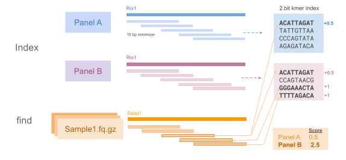

# PanelRecon

`PanelRecon` is a fast and highly sensitive tool to assign the most likely gene panel or exome to each fastq pair.



## How it works

PanelRecon compares the k-mer diversity in each sample against a precomputed panel k-mer index.
Top-scoring panels are identified based on the number of weighed supporting k-mers. Highly shared kmers across panels are penalized.
For high-scoring panel candidates (≥95% similarity), a further refining step is performed relying on panel-specific k-mers.


PanelRecon ranks panels with an f-score (`beta = 2`):  
- **score** = `(1 + beta^2) * (panelCoverage * specificityPrecision) / (beta^2 * specificityPrecision + panelCoverage)`.

Where,
- **panelCoverage** = `covered_panel_kmers / panel_unique_kmers`,
- **specificityPrecision**: is the fraction of matched weighted k-mer evidence assigned to that panel (shared k-mers are penalized). A higher score means the panel is both broadly covered and more specific to the sample.

## Installation

- To install `zlib` and `htslib`
```bash
sudo apt-get update
sudo apt-get install -y build-essential pkg-config zlib1g-dev libhts-dev
```

Requirements:

- C++17 compiler such as g++-
- `make`.
- `htslib`.
- `zlib`.

Build:

```bash
git clone https://github.com/GENCARDIO/PanelRecon.git
cd PanelRecon
make
```

## Commands

`PanelRecon` has two subcommands:

1. `index`: build panel index files (`.2bit`) from BED panels and a reference FASTA.
2. `find`: scan FASTQ reads against those indexes and rank panels.


### `1. Index`

```bash
./PanelRecon index \
  [--bed panel.bed | --bed_list beds.txt] \
  --fasta reference.fa \
  --output_dir /path/to/panel_index_dir \
  --kmer_size 31 (default is 31)
```

### `2. find`

Scan FASTQ reads against panel indexes and write ranking output.

Example with a paired FASTQ:
```bash
./PanelRecon find \
  --index_dir /path/to/panel_index_dir \
  --fq1 sample_R1.fastq.gz \
  --fq2 sample_R2.fastq.gz \
```

Example with a list of fastqs `--fastq_list`:
```bash
./PanelRecon find \ 
  --index_dir /path/to/panel_index \
  --fastq_list fastq_list.txt \
  --output /path/to/output_ranks.tsv
```

## Output

Panel ranking is written to `--output` (default: `panel_ranks.tsv`).

Example:
| sample | scanned_reads | best_panel | best_score | score_margin_vs_next | best_panel_covered_kmers | best_panel_covered_kmers_pct |
|---|---:|---|---:|---:|---:|---:|
| SAMPLE_A | 100000 | Exome.2bit | 0.6731 | 0.0312 | 129884 | 67.31 |
| SAMPLE_B | 50000 | GenePanel.2bit | 0.4108 | 0.0457 | 54321 | 41.08 |
