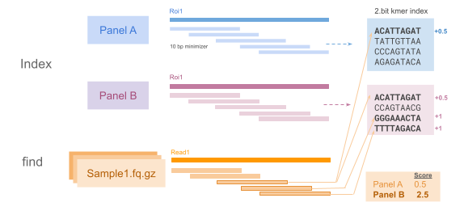
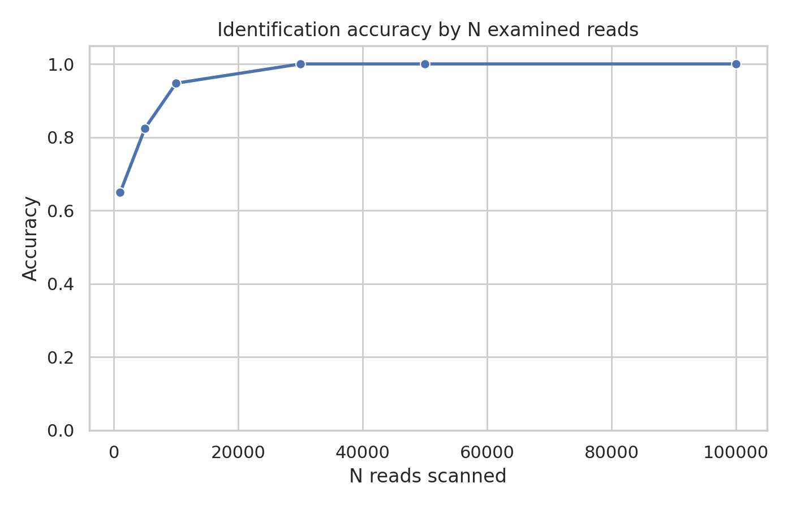
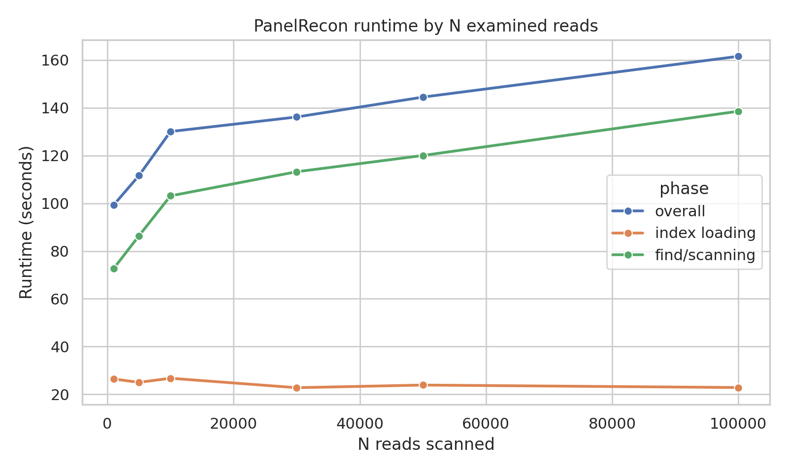
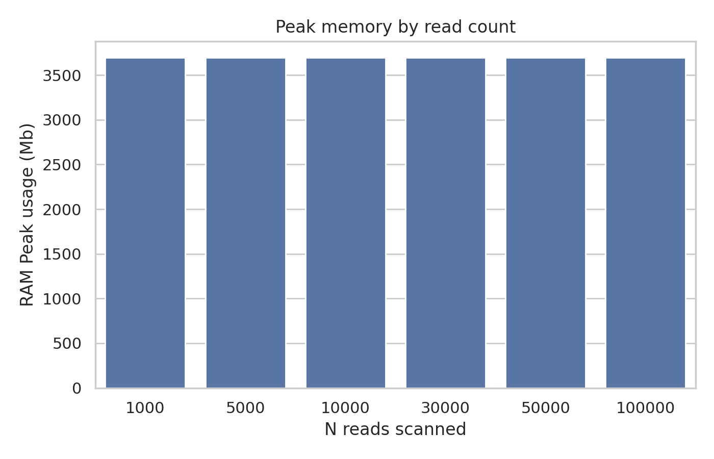
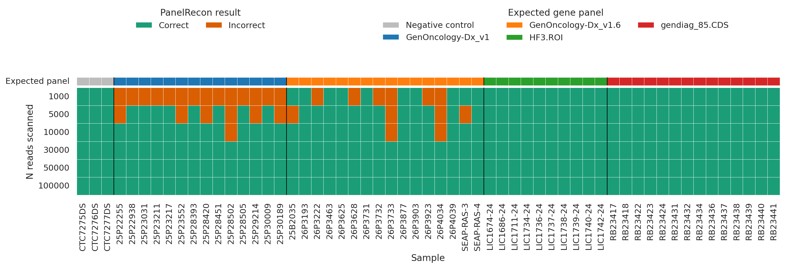

# PanelRecon

`PanelRecon` is a fast and highly sensitive tool to assign the most likely gene panel or exome to each FASTQ sample.



## Installation

- To install `zlib` and `htslib`
```bash
sudo apt-get update
sudo apt-get install -y build-essential pkg-config zlib1g-dev libhts-dev
```

Requirements:

- C++17 compiler such as `g++`.
- `make`.
- `htslib`.
- `zlib`.

Build:

```bash
git clone https://github.com/GENCARDIO/PanelRecon.git
cd PanelRecon
make
```

## Commands

`PanelRecon` has two subcommands:

1. `index`: build panel index files (`.2bit`) from BED panels and a reference FASTA.
2. `find`: scan FASTQ reads against `.2bit`/`.bit` indexes and rank panels.


### `1. Index`

```bash
./PanelRecon index \
  [--bed panel.bed | --bed_list beds.txt] \
  --fasta reference.fa \
  --output_dir /path/to/panel_index_dir \
  --kmer_size 31 \
  --minimizer_window 1
```

`index` minimizer notes:
- `--minimizer_window` controls k-mer subsampling while building indexes.
- Default is `1` (disabled, keep all k-mers).
- Values `> 1` keep minimizers per window and reduce index size.

`bed_list` notes:
- `--bed_list` must contain one BED path per non-comment line.
- Blank lines and lines starting with `#` are ignored.
- Relative paths are resolved relative to the list file.
- Existing `.2bit` files are skipped when indexing from `--bed_list`.

### `2. find`

Scan FASTQ reads against panel indexes and write ranking output.

Example with a paired FASTQ:
```bash
./PanelRecon find \
  --index_dir /path/to/panel_index_dir \
  --fq1 sample_R1.fastq.gz \
  --fq2 sample_R2.fastq.gz
```

Example with a list of FASTQs `--fastq_list`:
```bash
./PanelRecon find \
  --index_dir /path/to/panel_index \
  --fastq_list fastq_list.txt \
  --output /path/to/output_ranks.tsv
```

`fastq_list.txt` must contain exactly one FASTQ file path per non-comment line. Blank lines and lines starting with `#` are ignored.

Example with a TSV file `--fastq_tsv`:
```bash
./PanelRecon find \
  --index_dir /path/to/panel_index \
  --fastq_tsv samples.tsv \
  --output /path/to/output_ranks.tsv
```

`samples.tsv` must contain tab-separated columns:

```tsv
SAMPLE_A	/path/to/sample_A_R1.fastq.gz	/path/to/sample_A_R2.fastq.gz
SAMPLE_B	/path/to/sample_B.fastq.gz
```

Column 1 is the sample name written to the rank output TSV. Column 2 is `fq1`. Column 3 is optional `fq2`.

`find` options:
- `--min_reads`: warn if fewer than this many reads were scanned. Default: `50000`.
- `--max_reads`: stop scanning a sample after this many reads unless `--force_paired` applies. Default: `1000000`.
- `--minimizer_window`: keep minimizers while scanning reads. Default: `10`; use `1` to disable.
- `--min_kmer_entropy`: skip low-complexity k-mers below this Shannon entropy value. Default: `0.0` disabled; valid range is `0.0` to `2.0`.
- `--min_score`: minimum final score required to call a valid panel. Default: `0.001`; use `0` to disable.
- `--force_paired`: scan `fq2` even if `fq1` already reached `--max_reads`.

## Output

Panel ranking is written to `--output` (default: `panel_ranks.tsv`).

Example:
| sample | scanned_reads | best_panel | best_score | score_margin_vs_next | best_panel_covered_kmers | best_panel_covered_kmers_pct |
|---|---:|---|---:|---:|---:|---:|
| SAMPLE_A | 100000 | Exome.2bit | 67.31 | 3.12 | 129884 | 67.31 |
| SAMPLE_B | 50000 | GenePanel.2bit | 41.08 | 4.57 | 54321 | 41.08 |
| NEG_CTRL | 100000 | none | 0.000003 | 0.000003 | 1 | 0.000002 |

## How it works

PanelRecon compares sample k-mers against a precomputed panel k-mer index.


### Scoring

$$ 
100 \times \frac{(1 + \beta^2) \times panelCoverage \times panelSpecificSupport}{(\beta^2 \times panelSpecificSupport) + panelCoverage}
$$

where:

- **panelCoverage** = `covered_panel_kmers / panel_unique_kmers`. This rewards panels where many indexed k-mers were observed in the sample.
- **panelSpecificSupport** = `panel_weighted_support / total_matched_lookup_kmers`. This rewards panels supported by more panel-specific k-mers.

`covered_panel_kmers` is the number of distinct indexed k-mers from that panel found in the sample.
`panel_weighted_support` is the sum of specificity weights for matched k-mers assigned to a panel: a k-mer found in one panel contributes `1.0`, while a k-mer found in four panels contributes `0.25` to each panel.

With `beta = 2`, `panelCoverage` is weighted more strongly than `panelSpecificSupport`, so panels with broader k-mer coverage are prioritized. Panels supported mostly by k-mers shared across many panels are penalized.


### Second pass

If the top two panels are very close:
- both must have a positive primary score
- panel 2 must score at least `95%` of panel 1

PanelRecon then re-scores only that top pair using only k-mers that appear in exactly one of those two panels:

- **pair-specific score**:

$$
\frac{coveredPairSpecificKmers}{totalPairSpecificKmers}
$$

Those pair-specific scores replace the primary scores for the top two panels before the final ranking is reported.

### Minimum score

PanelRecon only reports a panel call when the final score is at least `--min_score`.
The default is `0.001`. Scores below this threshold are kept in the output for review,
but `best_panel` is reported as `none`.

## Evaluation

PanelRecon was evaluated on 57 samples with known expected panel assignments, including
3 negative controls expected to return `none`. The evaluation scanned each sample at
1, 5, 10, 30, 50, and 100 K reads.

Accuracy improved with read depth and reached 100% at 30k reads. At lower read usage
, some highly related panels were still difficult to distinguish because limited reads
covered fewer panel-specific k-mers.



Runtime increased with the number of reads scanned. Index runtime loading is stable
across runs, while the find/scanning phase increases with read depth.



Peak memory stays nearly constant across read depths, around 3.69 GB in this local
evaluation. This indicates that memory usage is mostly driven by loading the panel
k-mer index rather than by the number of reads scanned.



The per-sample heatmap shows correctness for each sample and read depth. Samples are
grouped by expected gene panel, and the top annotation row shows the expected panel
for each sample. The negative controls are grouped under the `Negative control` label
in the expected-panel legend.


